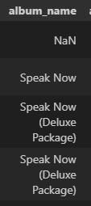
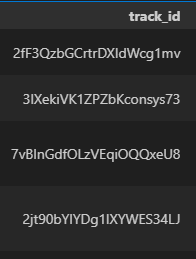
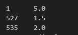

# Reporte de calidad de datos

# Vista general de los datos
Para iniciar se hizo una vista previa de los datos, donde se encontro como dato a resaltar el hecho de que la duración de las canciones esta en milisegundos, lo que dificulta su interpretacion, por lo que recomiendo transladarlo a minutos

# Datos faltantes
Una vez vista esa parte se pasa a verificar la cantidad de datos nulos, resaltando entre ellos la gran faltante de datos en cuanto a los nombres del album, lo cual se podria solucionar utilizando la columna del id del album, ya que esta no posee datos faltantes

# Datos repetidos
Ya habiendo visto esto, se procedio a ver cuales eran las canciones repetidas en la lista, se encontro que varias canciones se repetian, al mirar el porque se evidenció que en algunos casos es porque se repite en distintos albums, lo cual es entendible y debe permanecer así, aunque también se vió que en algunos casos es devido a que aparece dos veces en el mismo album, estos ultimos casos si se deben considerar datos repetidos, como por ejemplo en la cancion "The Story Of Us":

Tambien en la misma canción podemos tomar el ejemplo de la otra columna de referencia del archivo 'track_id', en donde deberiamos tener un id por canción, en este caso podemos ver un id distinto para la misma canción en las veces que se repite:

Proponiendo como solucion a esto primero corregir por nombre, dejando solamente una vez cada cancion en un mismo album y despues en base a eso crear un id para cada canción

# Detección de outliers

Primero se creó una función capaz de crear un diagrama de caja para poder ver los valores atípicos en las columnas seleccionadas.
Dichas columnas fueron seleccionadas bajo el criterio de cuales pueden servir como variables de análisis, estas son: 

'duration_ms': En la cual se encontraron valores de cero y menores a cero los cuales deben ser corregidos, ya que no son valores propios de la duración de una canción

'track_popularity': Este mide la popularidad de las canciones, las cuales vemos que en su mayoria son aceptadas por el público, si bien aparecen algunas con una valoración muy baja, no se podria considerar outlier, ya que esta columna se basa en el sentimiento de los usuarios

'audio_features.instrumentalness': Si bien en la consigna pide que no se tiene que corregir los errores, en esta fue necesario para seguir con el análisis. En esta columna podemos ver el porcentaje de contenido vocal, teniendo en cuenta la artista a la que se refiere esta columna y al ver que en ningun tema se pasa el 0,5, se puede decir que en esta columna no hay outliers

'audio_features.acousticness': En este caso si encontramos outliers, ya que encontramos valores superiores a 1.0, el cual debe ser el valor máximo debido a que hablamos de porcentajes

'audio_features.liveness': si bien los datos estan concentrados en un punto, los datos estan muy dispersos, asique no se pueden tomar como outliers los que no estan en la caja

'audio_features.speechiness': en este tampoco se pueden considerar outliers, ya que los valores altos pueden referir a canciones con mayor parte hablada y ninguno llega al 100%

'audio_features.loudness': En esta columna los datos que estan fuera de la caja son los bajos, y teniendo en cuenta el perfil de las canciones de la artista, no se los debe considerar como outliers, ya que significan canciones mas suaves y tranquilas

'audio_features.energy': En este caso nu fueron encontrados outliers

'audio_features.valence': En este caso nu fueron encontrados outliers

'audio_features.tempo': En este caso nu fueron encontrados outliers

Video del codigo: https://www.youtube.com/watch?v=4mFRa_sdCds